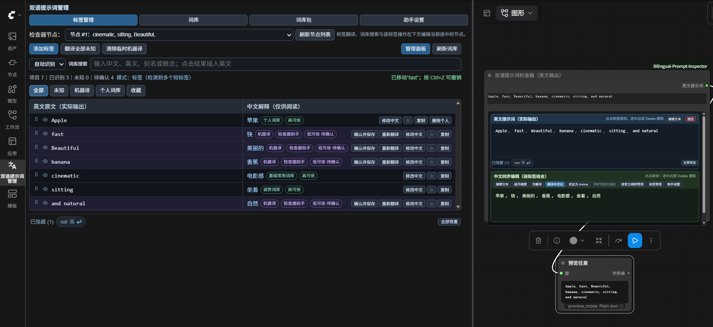
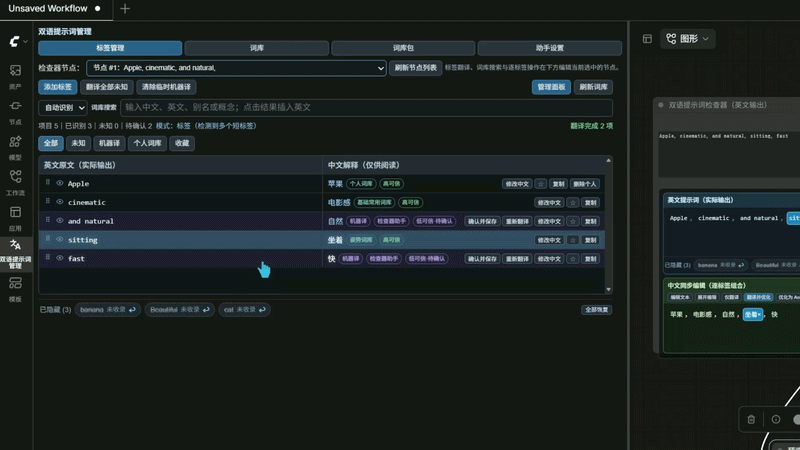
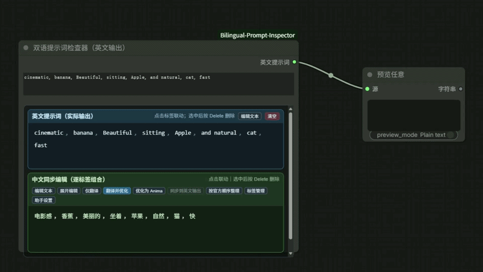

# ComfyUI 双语提示词管理器 v1.2.1

一个用于整理、检查和翻译 Anima / Danbooru 风格提示词的 ComfyUI 节点。既可以当普通英文提示词输入框用，也可以把提示词拆成可点击的英文标签 + 中文解释 + 词库记录，边写边确认每个标签到底在起什么作用。

> 本项目基于 [Qiongyi44/ComfyUI-Bilingual-Prompt-Inspector](https://github.com/Qiongyi44/ComfyUI-Bilingual-Prompt-Inspector) 二次开发，现已独立维护。在原版基础上新增了百度翻译、侧边栏管理面板，以及标签拖拽排序与临时隐藏功能。



## 功能一览

**提示词编辑**
- **标签化视图**：点一下英文标签，对应的中文解释和明细行会同步高亮，看不清的标签不用再猜。

- **拖拽排序**：按住标签直接拖动，或在明细表里拖 `⠿` 手柄，也可以选中后按 `Alt+↑` / `Alt+↓` 微调。排版不会乱——逗号空格样式保留，换行分段不被合并。

- **临时隐藏**：点标签上的眼睛图标隐藏它——标签**不会从节点里消失**，而是加删除线并灰化，照常可以拖动、改色、改权重，只是不参与最终输出（模型完全看不到它）。同时它会列在「已隐藏」区（可逐个或「全部恢复」取消隐藏），隐藏后那个眼睛会变成带斜线的图标，再点一下就恢复。做「有无这个标签」的对比出图很方便。

- **权重编辑**：双击标签设置 `0–3` 权重，支持常用预设与一键清除。

- **撤销重做**：删除、排序、隐藏、权重全部支持 `Ctrl+Z` / `Ctrl+Y`。

- **接管上游提示词**：左侧 `prompt` 输入口可接任意输出文本的上游节点。接管开启时运行到本节点会暂停，把上游文本导入后让你整理，点「继续运行」才输出给下游。

- **收藏**：遇到好用的提示词，点节点上「英文提示词（实际输入）」旁边的「收藏」按钮，命名后可选配一张出图截图，存进侧边栏「收藏」分页。

  

**翻译与整理**

- **三种处理方式**：仅翻译 / 翻译并优化 / 优化为 Anima。
- **Anima 顺序整理**：按官方推荐顺序把现有标签重新分段排列，不新增标签。
- **提示词诊断**：自动标出可疑的权重、重复标签、语法问题。
- **自动识别模式**：自动区分纯标签、纯自然语言、混合文本和翻译指令。

**词库与翻译服务**
- **多来源词库**：内置词库 + 个人词库 + 社区词库包，逐条说明解释来源。
- **概念搜索**：搜「丝袜」能返回连裤袜、长筒袜、过膝袜等相关标签；支持 40 项分页滚动加载。
- **可选大型 Danbooru 词库**：按需安装，覆盖更广。
- **翻译服务可选**：翻译/解释可选纯词库（离线）/ 百度翻译 / AI；"翻译并优化"与"优化为 Anima"恒走 AI。AI 与百度密钥独立留存，切换翻译服务互不清空。

**管理面板（侧边栏）**
- 标签管理、词库维护、助手设置、收藏集中在侧边栏「双语提示词管理」面板，节点本身保持简洁。
- 面板改动实时同步到页面上所有节点，无需刷新。

**收藏（保存到用户目录）**
- 收藏内容存在 ComfyUI 用户目录 `user/bilingual-prompt-inspector/saved_prompts/`，不写在插件目录里，重装或更新插件不会丢。
- 支持搜索、备注、配图、复制、导出/导入 JSON 备份。
- 「载入节点」会先弹窗确认再覆盖节点文本（不支持 `Ctrl+Z` 撤销）。

## 安装

```bash
cd ComfyUI/custom_nodes/
git clone https://github.com/mengshengzhijie/ComfyUI-Bilingual-Prompt-Inspector.git
```

重启 ComfyUI 后，在节点菜单的 **文本/提示词工具** 分类里找到 **提示词翻译与管理（英文输出）**。

> 从原版升级：直接覆盖 `custom_nodes` 下的目录即可，个人词库与词库设置会保留。

## 快速上手

1. 把节点接到 CLIP 文本编码器上（和普通提示词节点一样）。
2. 在节点顶部输入英文提示词，或点击「编辑文本」写好后完成编辑。
3. 在标签联动模式里逐个检查：点标签看中文解释，双击调权重，拖动手柄排顺序。
4. 想试某个标签的影响？点眼睛图标隐藏它，重新出图对比，再一键恢复。



## 接管上游提示词（暂停确认）

节点左侧有一个 `prompt` 输入口，接法和 CLIP 文本编码器一样：把上游节点的文本输出拖过来即可。不接时节点行为和以前完全一样。

接上之后，节点内「英文提示词（实际输入）」上方会出现一条「上游输入」控制条：

- **接管上游文本**（默认开启）：运行时先把上游文本导入节点，然后**暂停工作流**让你整理——排序、隐藏、翻译、直接改都行——点「继续运行」后才把结果交给下游。暂停期间下游不会执行，也不占用显卡资源。
- 关闭时节点等价于一根导线：上游文本原样流向下游，不导入、不暂停。
- **导入策略**（仅接管时可用）决定上游文本何时覆盖节点内容：`内容变化时`（默认，不会冲掉你改过的内容）／`每次运行`／`仅首次`。

几点说明：

- 暂停用的是 ComfyUI 的异步节点机制，不是死等轮询。等待期间可以点 ComfyUI 的取消中断，也可以点「放弃」终止本次等待。
- 暂停会占用 ComfyUI 的执行线程，队列里的其它任务要等这次确认完成。
- 没有浏览器界面时（例如用 API 提交工作流）没人能确认，节点会在约 20 秒后自动按透传放行，不会永久卡住。

## 收藏提示词

**保存**：出了一张满意的图，点节点上「英文提示词（实际输入）」右侧的「收藏」按钮 → 填名字、可写备注、拖入或粘贴一张配图 → 保存。提示词正文只读展示，保存的就是节点当前这份英文文本（包含可能存在的已隐藏标签）。如果当前不在节点上，也可以从侧边栏「收藏」分页点「新建」，再选一个节点读取它的文本。

**使用**：侧边栏「双语提示词管理 → 收藏」分页里按卡片浏览，可搜索、复制文本、载入节点、删除，也可以整包导出 JSON 给别的机器导入。

**存放位置**：`ComfyUI/user/bilingual-prompt-inspector/saved_prompts/`（`index.json` + 按 id 命名的图片文件），跟随 ComfyUI 的用户目录，不在插件目录内。单图上限 5 MB，最多 2000 条。

## 翻译服务配置

默认走纯词库，不联网也能用。需要机器翻译或 AI 优化时，点击节点上的「助手设置」按钮（或侧边栏面板的助手设置分页）选择服务。

助手设置面板分三段：

**翻译服务**（翻译 / 解释按此选择）

| 服务 | 说明 |
|---|---|
| 纯词库 | 只查本地词库，完全离线，不产生费用 |
| 百度翻译 | 需自行申请百度翻译开放平台的 APP ID 和密钥 |
| AI | 翻译/解释走 AI（OpenAI 兼容 API 或 Ollama），需填 AI 配置 |

**百度翻译**（独立配置，切翻译服务不清密钥）：填百度 APP ID 与密钥。

**AI 服务**（"翻译并优化""优化为 Anima"恒走 AI；翻译在选 AI 时也走它）：选 AI 后端（OpenAI 兼容 / Ollama）、填 API 地址与模型、可选 API Key、温度与超时。

> 两个密钥独立留存——切换翻译服务互不清空，只有「AI 后端/地址变了」或「换机器」时才清 AI Key；百度密钥只在显式勾选"清除"时才清。两者均不写入工作流、不返回浏览器。

## 大型词库（可选）

由于社区数据的授权边界，本仓库不附带 `danbooru_tags.sqlite3`。需要更大覆盖面时按 `release_docs/大型词库手动安装说明.txt` 自行构建安装；不装也不影响其他功能，界面会明确提示「未安装」。

## 常见问题

**找不到节点？** 确认 `custom_nodes` 下目录名正确、已重启 ComfyUI；完全刷新浏览器（`Ctrl+F5`）清掉旧 JS 缓存。

**界面还是旧的？** ComfyUI 前端缓存较顽固，强制刷新或清一次浏览器缓存。

**翻译按钮提示需要模型？** 纯词库模式下只能查词库，想翻译请在助手设置里选一个翻译服务。

**切换翻译服务后 Key 消失？** 不会。v3 起两套密钥独立留存，切换翻译服务互不清空；只有 AI 后端/地址变更或换机器时才清 AI Key。

## 已知边界

- 本扩展是提示词工具，不保证某个标签一定被模型准确执行。
- 自动翻译和优化结果都需要人工复查。
- 自然语言块不支持按内部单词逐项删除，应回到文本模式修改。
- 拖拽排序与隐藏只在标签模式和混合模式下可用。
- 隐藏清单保存在节点属性中，导出「API 格式」JSON 时不会带出（届时隐藏标记丢失，被隐藏的标签会直接出现在输出里）。
- 接管上游提示词需要浏览器界面来确认；用 API 提交工作流时节点会自动透传，不会等待确认。
- 接管开关与导入策略同样保存在节点属性中，导出「API 格式」JSON 时不会带出。
- 收藏不记录工作流名称与节点编号；载入节点会覆盖节点当前文本，只弹窗确认、不支持撤销。
- 若 ComfyUI 大幅改动前端文本控件结构，界面适配可能需要更新。

## 报告问题与联系

本插件由 mengshengzhijie 独立维护。遇到问题、有功能建议，请按下面的方式反馈（**不要附带 API Key、密钥、私人词典或完整配置文件**）：

- GitHub Issues：https://github.com/mengshengzhijie/ComfyUI-Bilingual-Prompt-Inspector/issues
- 邮箱：mengshengzhijie@163.com

反馈时请附上：ComfyUI 版本、前端版本、安装方式（git clone / ComfyUI-Manager / 桌面版）、浏览器或桌面环境、复现步骤，以及去掉敏感信息的报错日志。

安全问题（如密钥泄露风险）请不要开公开 issue，走 [GitHub 私有漏洞报告](https://github.com/mengshengzhijie/ComfyUI-Bilingual-Prompt-Inspector/security/advisories/new) 或发邮件，详见 `SECURITY.md`。

## 致谢与许可

基于 [Qiongyi44/ComfyUI-Bilingual-Prompt-Inspector](https://github.com/Qiongyi44/ComfyUI-Bilingual-Prompt-Inspector) 二次开发。词库数据来源与授权说明见 `THIRD_PARTY_NOTICE.md`，许可条款见 `LICENSE`。

详细使用手册见 `release_docs/使用手册(原README).md`。
