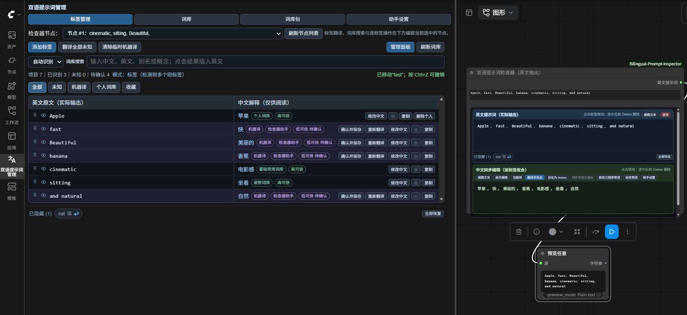

# ComfyUI 双语提示词管理器 v2.0.0

> ComfyUI 双语提示词节点：把英文提示词拆成可点击的标签，边写边看中文解释、调顺序、试效果。

<p align="center">
  
</p>
**它解决什么问题**：Anima / Danbooru 风格的提示词是一长串英文标签，写完很难确认模型到底读到了什么。这个节点把提示词变成可选中、可删除、可排序的芯片，每个芯片旁边就是它的中文解释；输出的永远只有英文提示词本身，中文只用于阅读。

---

## 目录

- [主要功能](#主要功能)
  - [提示词编辑](#提示词编辑)
  - [翻译与整理](#翻译与整理)
  - [词库与翻译服务](#词库与翻译服务)
  - [上游提示词接管](#上游提示词接管)
  - [收藏](#收藏)
  - [侧边栏管理面板](#侧边栏管理面板)
- [界面导览](#界面导览)
- [安装](#安装)
- [快速上手](#快速上手)
- [详细说明](#详细说明)
- [常见问题](#常见问题)
- [已知边界](#已知边界)
- [性能与隐私](#性能与隐私)
- [反馈与联系](#反馈与联系)

---

## 主要功能

### 提示词编辑

<table>
<tr>
<td width="26%"><b>标签化视图</b></td>
<td>英文提示词按标签切成芯片，点一下就和下方的中文解释、明细行联动高亮。看不清楚的标签不用再猜。</td>
</tr>
<tr>
<td><b>编辑 / 标签两种形态</b></td>
<td>「编辑文本」在纯文本编辑和标签视图之间切换。写完点「完成」进入标签视图，随时可以切回去改。</td>
</tr>
<tr>
<td><b>拖拽排序</b></td>
<td>按住标签直接拖，或在明细表里拖 <code>⠿</code> 手柄；也可以选中后用 <code>Alt+↑</code> / <code>Alt+↓</code> 微调。排版不会乱——逗号空格样式保留，换行分段不被合并。</td>
</tr>
<tr>
<td><b>临时隐藏</b></td>
<td>点标签上的眼睛图标把它移出实际输出。标签不会从节点里消失，只是加删除线并灰化，照常可以拖动、改色、改权重，但模型完全看不到它。适合做「有 / 没有这个标签」的对比出图，之后逐个或一次性全部恢复。</td>
</tr>
<tr>
<td><b>权重编辑</b></td>
<td>双击标签设置 <code>0–3</code> 权重，有常用预设和一键清除。</td>
</tr>
<tr>
<td><b>颜色分区</b></td>
<td>标签可按「收录状态」着色（未收录 / 机器翻译各自一色），也可以随机着色帮助分辨；需要时一个个自定义。</td>
</tr>
<tr>
<td><b>撤销重做</b></td>
<td>删除、排序、隐藏、权重、清空全部支持 <code>Ctrl+Z</code> / <code>Ctrl+Y</code>。</td>
</tr>
<tr>
<td><b>换行分段</b></td>
<td>提示词里的换行会渲染成行尾的 <code>↵</code> 块，标签区真的断行，中英两栏行数对齐。换行块本身也能拖动。</td>
</tr>
</table>


### 翻译与整理

| 能力 | 说明 |
|---|:-:|
| **四种处理方式** | 仅翻译 / 翻译并优化 / 优化为 Anima / 按 Anima 官方顺序整理（不新增标签，只重排分段） |
| **自动识别模式** | 自动区分纯标签、纯自然语言、混合文本和翻译指令，不用手选模式 |
| **提示词诊断** | 自动标出可疑权重、重复标签、语法问题 |
| **快捷添加** | 底部的快捷输入框：写中文自动翻译成英文标签后追加，写英文标签直接追加；`Enter` 添加、`Shift+Enter` 换行、`Ctrl+Enter` 翻译并优化 |

### 词库与翻译服务

| 能力 | 说明 |
|---|---|
| **多来源词库** | 内置词库 + 个人词库 + 社区词库包，每条解释都会标注来源 |
| **概念搜索** | 搜「丝袜」能返回连裤袜、长筒袜、过膝袜等相关标签，支持滚动分页加载 |
| **大型 Danbooru 词库（可选）** | 按需安装，覆盖面更广，不装也不影响其它功能 |
| **翻译服务可切换** | 纯词库（离线、免费）/ 百度翻译 / AI（OpenAI 兼容 API 或 Ollama）。翻译与解释可选任意一种；「翻译并优化」「优化为 Anima」恒定走 AI |
| **密钥互不干扰** | AI 与百度密钥独立留存，切换翻译服务不会清空；均不写入工作流、不返回浏览器 |

### 上游提示词接管

节点左侧有一个 `prompt` 输入口，接法与 CLIP 文本编码器完全一样，把上游节点的文本输出拖过来即可。不接的时候节点行为和普通提示词节点一样。

接上之后，节点顶部会出现「上游输入」控制条：

- **拦截上游文本**（默认开启）：运行时先把上游文本导入节点，然后**暂停工作流**让你整理——排序、隐藏、翻译、直接改都行——点「继续」后才把结果交给下游。暂停期间下游不执行，也不占用显卡资源。
- **关闭拦截**：节点等价于一根导线，上游文本原样流向下游，不导入、不暂停。
- **导入策略**（仅拦截时可用）：`导入：内容变化时`（默认，不会冲掉你手工改过的内容）／ `导入：每次运行` ／ `导入：仅首次运行`。

三点注意事项：

1. 暂停用的是 ComfyUI 原生的异步节点机制，不是死等轮询；等待期间可以点 ComfyUI 的取消中断，也可以点「丢弃」终止本次等待。

2. 暂停会占用 ComfyUI 的执行线程，队列里的其它任务要等这次确认完成。

3. 没有浏览器界面时（例如用 API 提交工作流）没人能确认，节点约 20 秒后自动按透传放行，不会永久卡住。

   

### 收藏

出了一张满意的图，把当时的提示词存下来，下次直接复用。

- **保存**：点节点上「英文原文（实际输出）」右侧的「收藏」按钮 → 填名字、写备注（可留空）、标上适合的模型、拖入或粘贴一张出图截图 → 保存。保存的是节点当前这份英文文本（包含其中被隐藏的标签）。不在节点上时，也可以从侧边栏「收藏」分页点「新建」，再选一个节点读取文本。
- **适合模型**：输入关键词，会从本机 `models/` 目录（checkpoints、diffusion_models、loras、embeddings、text_encoders）里匹配已安装的模型；`Enter` 把高亮那条加成标签，`↑↓` 切换候选，列表里没有的名字也能直接回车当自由文本填进去。最多 20 个。
- **编辑**：卡片上的「编辑」按钮打开和保存时同一个弹窗，名字、备注、适合模型、配图、提示词正文都能改。不选新图就保持原图，选了新图会替换并删掉旧的。
- **使用**：侧边栏「收藏」分页按卡片浏览，卡片直接显示适合模型和备注；支持搜索（模型名也算）、编辑、复制、载入节点、删除，也可以整包导出 JSON 给别的机器导入。
- **存放位置**：`ComfyUI/user/bilingual-prompt-inspector/saved_prompts/`（`index.json` + 按 id 命名的图片文件），跟随 ComfyUI 用户目录，不在插件目录内，重装或更新插件不会丢。单图上限 5 MB，最多 2000 条。

> 「载入节点」会先弹窗确认再覆盖节点文本，这个动作**不支持 `Ctrl+Z` 撤销**。

### 侧边栏管理面板

标签管理、词库维护、词库包、助手设置、收藏五个分页都收在侧边栏的「双语提示词管理」面板里，节点本身保持简洁。面板里的改动会实时同步到页面上所有同类节点，不需要刷新页面。

---

## 界面导览


节点上可以大致分成四块：

1. **英文原文（实际输出）**——节点真正输出给下游的文本。上面有「编辑文本 / 完成」「清空」「插入换行」「收藏」「优化为 Anima」「按 Anima 顺序排序」几个按钮。
2. **中文对照区**——英文标签逐条对应的中文，只用于阅读，不进入输出，也不会传给下游。
3. **明细表**——每行是一个标签：来源、翻译、权重、分类，右侧按行状态给出操作（翻译 / 确认并存 / 重新翻译 / 编辑中文 / 收藏 / 复制 / 删除个人词条）。上方有搜索框、模式选择、颜色模式、筛选（全部 / 未知 / 机器翻译 / 个人词库 / 收藏）和问题提示。
4. **快捷添加**——底部输入框，中文进英文出（自动翻译后追加），英文则直接追加。

---

## 安装

**用 ComfyUI-Manager（推荐）**：在 Manager 的节点列表里搜索 `Bilingual Prompt Inspector` 安装；也可以走 Manager 的「Install via Git URL」，填入下面的仓库地址。

**手动安装**：

```bash
cd ComfyUI/custom_nodes/
git clone https://github.com/mengshengzhijie/ComfyUI-Bilingual-Prompt-Inspector.git
```

重启 ComfyUI，在节点菜单的 **text/prompt** 分类里找到 **提示词翻译与管理（英文输出）**（英文界面下显示为 Prompt Translator & Manager），也可以直接搜索「提示词」。

两个常见坑：

- 装完看不到节点 → 先确认 `custom_nodes` 下的目录名正确、ComfyUI 确实重启了，然后 **`Ctrl+F5` 完全刷新浏览器**，清掉旧的 JS 缓存。
- 从原版（[Qiongyi44/ComfyUI-Bilingual-Prompt-Inspector](https://github.com/Qiongyi44/ComfyUI-Bilingual-Prompt-Inspector)）升级 → 直接覆盖 `custom_nodes` 下的目录，个人词库与词库设置会保留。

> Nodes 2.0（ComfyUI 设置里的「现代节点设计」）下，标签拖拽排序与上游即时拦截**已被官方前端旁路，无法工作**，这是前端渲染方式的限制。要用完整功能请关闭该选项；1.2.1 起其余功能在两种模式下都正常。

---

## 快速上手

1. 把节点接到 CLIP 文本编码器上，和普通提示词节点一样。
2. 在「英文原文」里写提示词，或点「编辑文本」写完后点「完成」。
3. 在标签视图里逐个检查：点标签看中文解释，双击调权重，拖动手柄排顺序。
4. 想确认某个标签到底有没有用？点眼睛图标隐藏它，重新出图对比，再一键恢复。


---

## 详细说明

### 翻译服务配置

默认走纯词库，不联网也能用。需要机器翻译或 AI 优化时，打开侧边栏「双语提示词管理」面板的「助手设置」分页。面板分三段：

| 分段 | 内容 |
|---|---|
| **翻译服务** | 翻译 / 解释按此选择：纯词库（离线、免费）／ 百度翻译（需自行申请开放平台的 APP ID 与密钥）／ AI（走下面的 AI 配置） |
| **百度翻译** | 独立配置 APP ID 与密钥，切换翻译服务不会清空 |
| **AI 服务** | 后端（OpenAI 兼容 / Ollama）、API 地址与模型、可选 API Key、温度、超时。「翻译并优化」「优化为 Anima」恒定走这里 |

### 大型词库（可选）

由于社区数据的授权边界，本仓库不附带 `danbooru_tags.sqlite3`。需要更大覆盖面时，按 `release_docs/大型词库手动安装说明.txt` 自行构建安装；不装也不影响其它功能，界面会明确显示「未安装」。

### 界面语言与外观

界面文案跟随 ComfyUI 的语言设置，也可以在侧边栏面板的「助手设置」分页里固定为中文或英文。外观同样可在「跟随 ComfyUI / 暗色 / 亮色」之间切换。

---

## 常见问题

<details>
<summary><b>找不到节点 / 界面还是旧的</b></summary>
先确认 `custom_nodes` 下的目录名正确、ComfyUI 确实重启过；然后强制刷新浏览器（`Ctrl+F5`）清掉旧 JS 缓存。ComfyUI 前端缓存比较顽固，这一步不能省。
</details>

<details>
<summary><b>点翻译提示要先配置翻译服务</b></summary>

纯词库模式下只能查词库，不会翻译。想翻译请在侧边栏面板的「助手设置」分页里选一个翻译服务（百度或 AI）。
</details>

<details>
<summary><b>切换翻译服务后密钥消失了？</b></summary>
不会。两套密钥独立留存，切换翻译服务互不清空。只有 AI 后端 / 地址变更或换机器时才清 AI Key，百度密钥只在显式勾选「清除」时才清。
</details>

<details>
<summary><b>拖拽排序 / 隐藏没反应？</b></summary>

这两种操作只在标签模式与混合模式下可用，纯自然语言模式下没有意义。另外如果开了 ComfyUI 的「现代节点设计（Nodes 2.0）」，请关掉再试，原因见上文安装一节。
</details>

<details>
<summary><b>运行到一半卡住了，好像在等什么</b></summary>
这是上游接管的暂停确认。节点在等你整理导入的上游文本，点「继续」放行，或点「丢弃」终止本次等待；也可以直接点 ComfyUI 的取消中断。无人确认时约 20 秒会自动透传。
</details>

---

## 已知边界

- 本扩展是提示词工具，**不保证**某个标签一定被模型准确执行。
- 自动翻译与优化结果都需要人工复查。
- 自然语言块不支持按内部单词逐项删除，要回文本模式改。
- 拖拽排序与隐藏只在标签模式和混合模式下可用。
- 隐藏清单、接管开关与导入策略都保存在节点属性里，导出「API 格式」JSON 时不会带出——届时隐藏标记会丢失，被隐藏的标签会直接出现在输出里。
- 接管上游提示词需要浏览器界面来确认；用 API 提交工作流时节点自动透传，不会等待。
- 收藏不记录工作流名称与节点编号；载入节点会覆盖节点当前文本，只弹窗确认，不支持撤销。
- 若 ComfyUI 大幅改动前端文本控件结构，界面适配可能需要跟着更新。

---

## 性能与隐私

- **默认不联网**：翻译服务的默认选项是纯词库，完全离线。
- **只在你主动使用某个服务时才发请求**：调用百度或 AI 时，发送的是提示词文本与你的指令；密钥只存在后端本地，不回传浏览器、不写入工作流。
- **大型词库按需加载**：不安装就不加载，装了也是本地文件查询。
- **收藏只存在本机**：写在 ComfyUI 用户目录下，插件不做任何上传。

---

## 反馈与联系

本插件由 mengshengzhijie 独立维护。遇到问题或有功能建议，欢迎反馈（**不要附带 API Key、密钥、私人词典或完整配置文件**）：

- GitHub Issues：https://github.com/mengshengzhijie/ComfyUI-Bilingual-Prompt-Inspector/issues
- 邮箱：mengshengzhijie@163.com

反馈时请附上：ComfyUI 版本、前端版本、安装方式（git clone / ComfyUI-Manager / 桌面版）、浏览器或桌面环境、复现步骤，以及去掉敏感信息的报错日志。

安全问题（如密钥泄露风险）请不要开公开 issue，走 [GitHub 私有漏洞报告](https://github.com/mengshengzhijie/ComfyUI-Bilingual-Prompt-Inspector/security/advisories/new) 或发邮件，详见 `SECURITY.md`。

---

## 致谢与许可

基于 [Qiongyi44/ComfyUI-Bilingual-Prompt-Inspector](https://github.com/Qiongyi44/ComfyUI-Bilingual-Prompt-Inspector) 二次开发，现已独立维护。在原版基础上新增了百度翻译、侧边栏管理面板、标签拖拽排序、临时隐藏、上游接管与收藏。

词库数据来源与授权说明见 `THIRD_PARTY_NOTICE.md`，许可条款见 `LICENSE`，完整使用手册见 `release_docs/使用手册(原README).md`。
